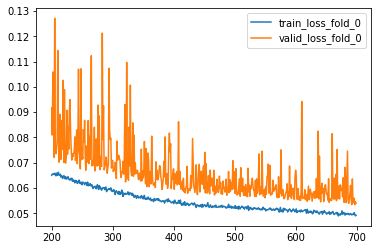

# Seismic Facies Identification Challenge

Simple solution (0.857 F1-Score / 0.906 Acc public LB) for take part in [AIcrowd Seismic Facies Identification Challenge](https://www.aicrowd.com/challenges/seismic-facies-identification-challenge/leaderboards).

## Reference
* [Flexible library for training NNs in pytorch](https://github.com/lRomul/argus)
* [Explained pipeline from similar competition](https://github.com/avalur/ml_trainings_spbu/tree/master/08.boosters.classification)

## For inference

[Pretrained weights from one of 5 folds](https://drive.google.com/file/d/1LxUT69za4qnA-BCzr6t0lSYrt1VR9RUQ)

  

## Solution
* [UNet (efficientnet-b3 encoder) + scse](https://github.com/qubvel/segmentation_models.pytorch)
* [Augs](https://github.com/albumentations-team/albumentations): HorizontalFlip, ShiftScaleRotate
* Loss: 0.75 * Lovasz + 0.25 * CE
* Optimizer: SGD with LR 0.01, momentum 0.9, weight_decay 1e-4
* Crop-predict: ImageSlicer from [pytorch-toolbelt](https://github.com/BloodAxe/pytorch-toolbelt)